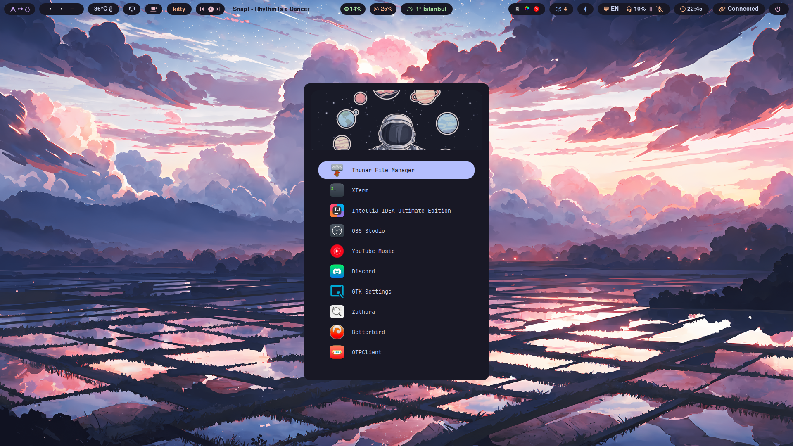
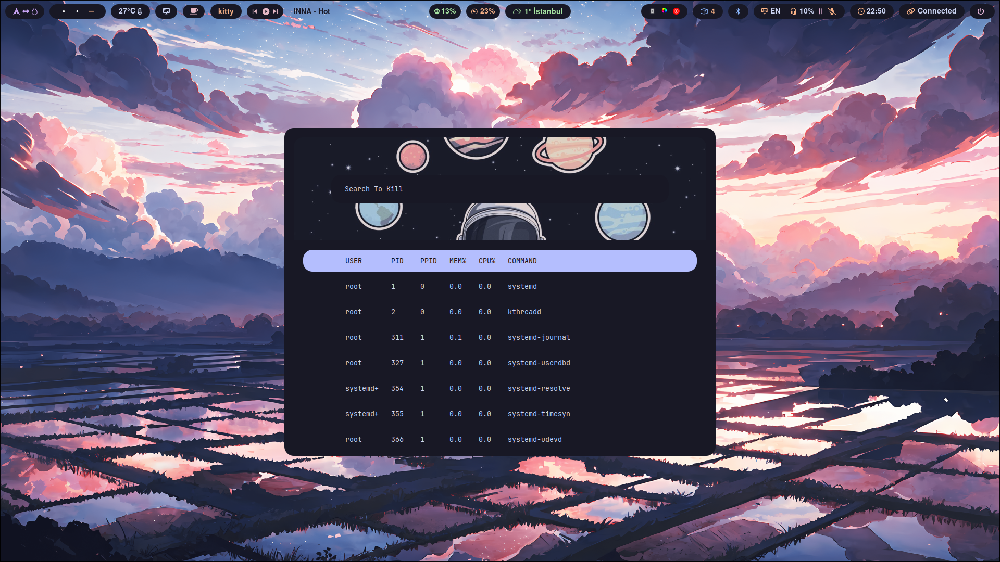
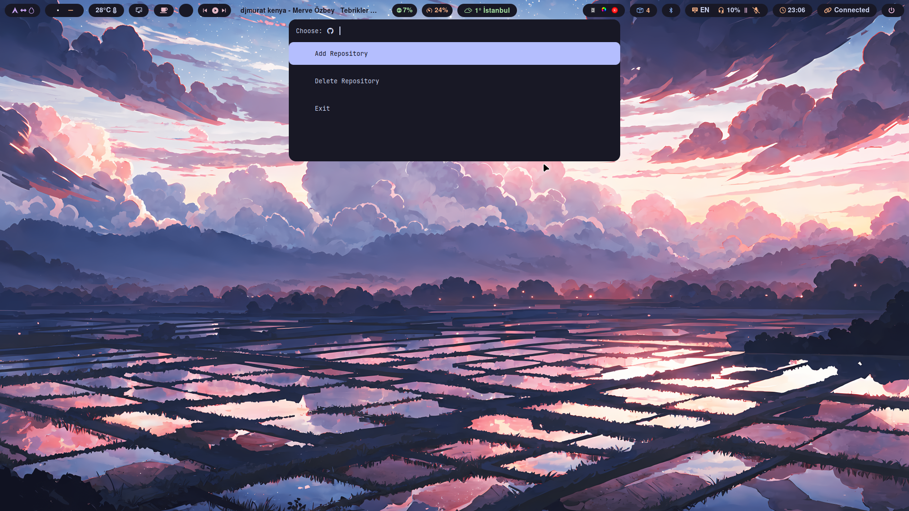
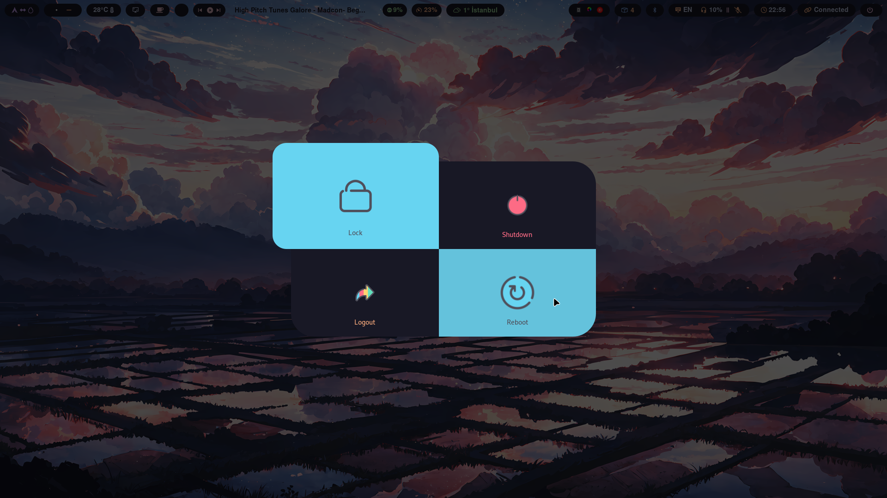
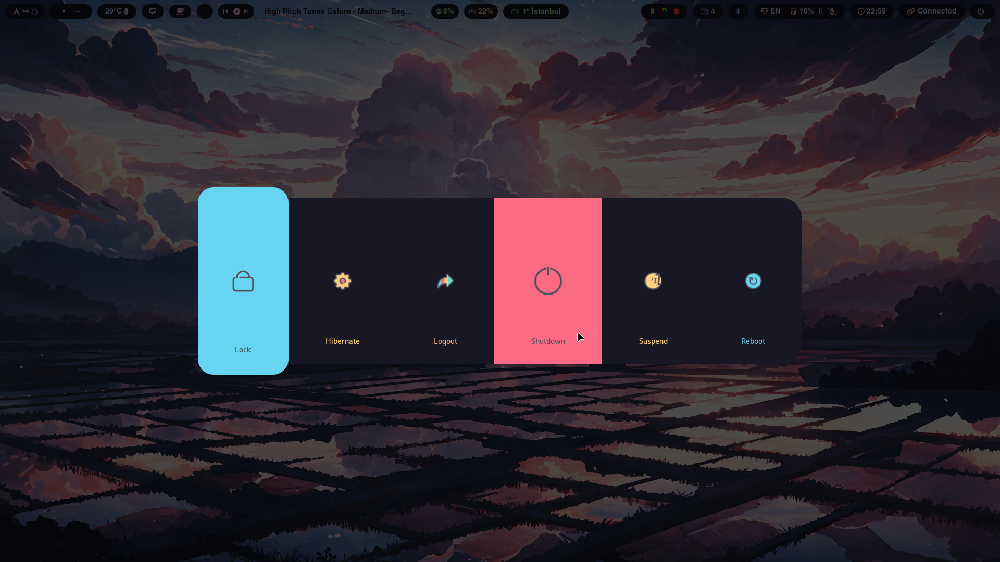
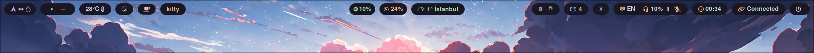
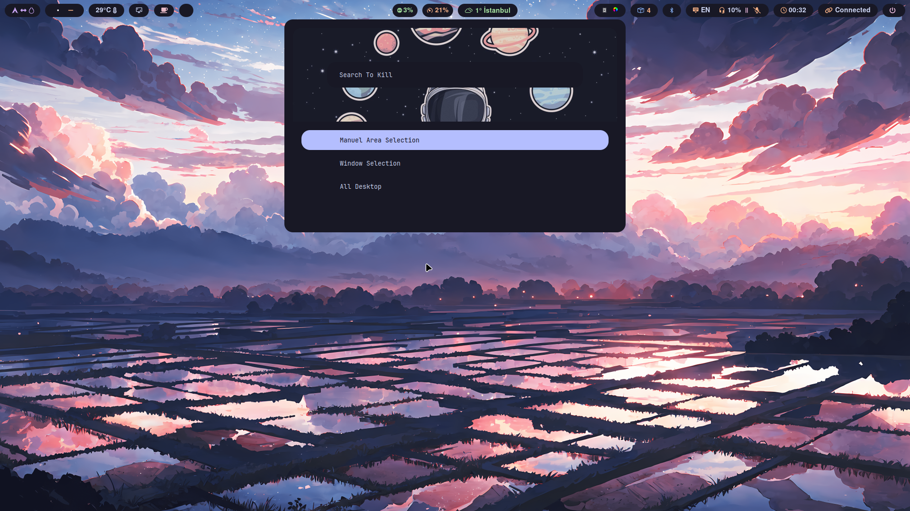
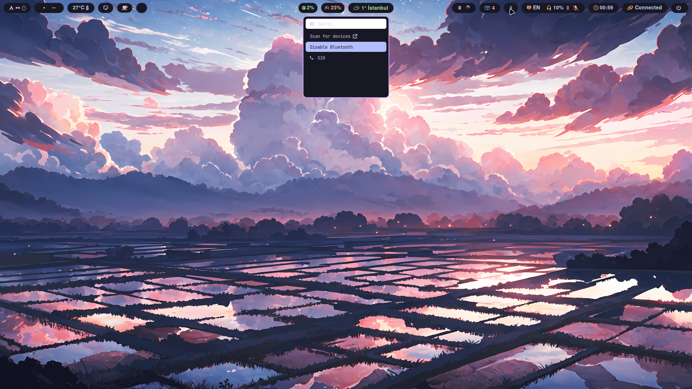

# [](https://git.io/typing-svg)

This repository contains my personal Hyprland configuration files. It includes settings for window management, keybindings, themes, and additional tweaks for an optimized workflow.

## [](https://git.io/typing-svg)

| Launcher                                | Rofi Apps Killer                                       | Github GUI                              | Wlogout Menu 1                              |
| --------------------------------------- | ------------------------------------------------------ | --------------------------------------- | ------------------------------------------- |
|  |  |  |  |

| Wlogout Menu 2                                   | Waybar                              | Screenshot Gui Menu                          | Bluetooth Menu                                 |
| ------------------------------------------------ | ----------------------------------- | -------------------------------------------- | ---------------------------------------------- |
|  |  |  |  |

## [](https://git.io/typing-svg)

- **Custom Keybindings**: Optimized keybindings for navigation and productivity.
- **Waybar Integration**: A customized status bar with essential system information.
- **Performance Tweaks**: Configurations for smooth performance on Wayland.
- **Hyprlock Setup**: Lock screen integration.

## [](https://git.io/typing-svg)

### 1. Install Dependencies

Ensure you have the required packages installed:

```bash
yay -S waybar rofi-wayland wl-clipboard cliphist tmux pavucontrol
```

If you're using a different package manager, install the equivalent packages.

> [!NOTE]  
> **_Install All Hypr Ecosystem_** [Hypr Ecosystem](https://wiki.hyprland.org/Hypr-Ecosystem/)

<!-- **_And install all hypr ecosystem_** -->

### 2. Clone the Repository

```bash
cd ~/
git clone https://github.com/Mestane/HaLLaC_Hypr.git
```

> [!CAUTION]  
> Please copy the files inside the Script folder to the ~/.local/bin/ folder.

### 3. Apply Configuration

Symlink or copy the config files:

> [!WARNING]
> DIKKAT !
> Please make a backup of your config file :)

```bash
cp -r ~/.config/ ~/.config.bak/
```

```bash
cd ~/HaLLaC_Hypr
cp -r .config/hypr/ ~/.config/hypr
```

### 4. Restart Hyprland

After setting up, restart Hyprland for changes to take effect:

```bash
hyprctl reload
```

## [](https://git.io/typing-svg)

| Keybinding          | Action                                      |
| ------------------- | ------------------------------------------- |
| `Super + T`         | Launch Terminal (Kitty)                     |
| `ALT + Q`           | Close Focused window                        |
| `Super + Return`    | Open Rofi application launcher              |
| `Super + Q`         | Wlogout Menu                                |
| `ALT + V`           | Clipboard Menu                              |
| `Super + E`         | Launch Thunar                               |
| `Super + B`         | Launch Zen Browser                          |
| `Super + Tab`       | Change Focus And Bring It To The Top        |
| `Super + l,h,k,j`   | Move Focus Windows                          |
| `Super + R`         | Active Resize Submap (tile or float window) |
| `Super + C`         | Reset Resize Submap (tile or float window)  |
| `Print`             | Screenshot Menu                             |
| `ALT + R`           | Github Gui Manager                          |
| `Super + S`         | Toggle Special Workspace                    |
| `Super + W`         | Move Back From Special Workspace            |
| `Super + U`         | Toggle Full Screen Mode                     |
| `Super + V`         | Toggle Floating Window                      |
| `Super + ALT + K`   | Move Window Right Workspace (relative)      |
| `Super + ALT + H`   | Move Window Left Workspace (relative)       |
| `Super + SHIFT + L` | Move Window Second Monitor                  |
| `Super + SHIFT + K` | Move Window Main Monitor                    |

> [!IMPORTANT]
> If you use Multi Monitor
> please set your monitors ID from **_keybindings.conf_**

<!-- ## Customization -->

Feel free to modify the configurations according to your preferences. Contributions and suggestions are welcome!
